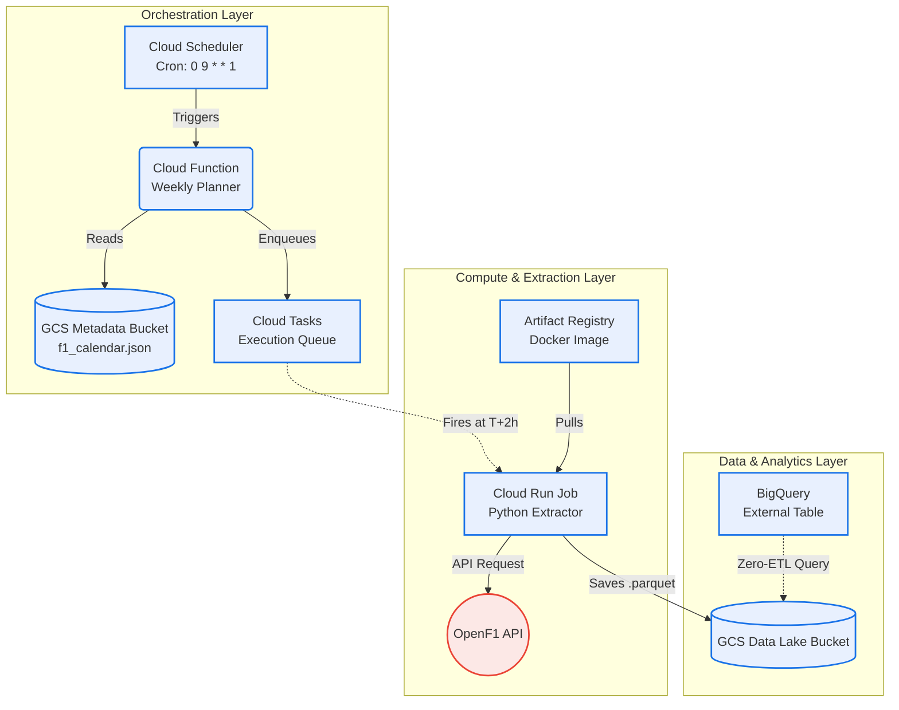

# f1-dataops
An automated, idempotent batch processing architecture for F1 data. Features GCS data lakes, BigQuery data warehousing, infrastructure as code with Terraform and CI/CD pipeline with Github Actions.

