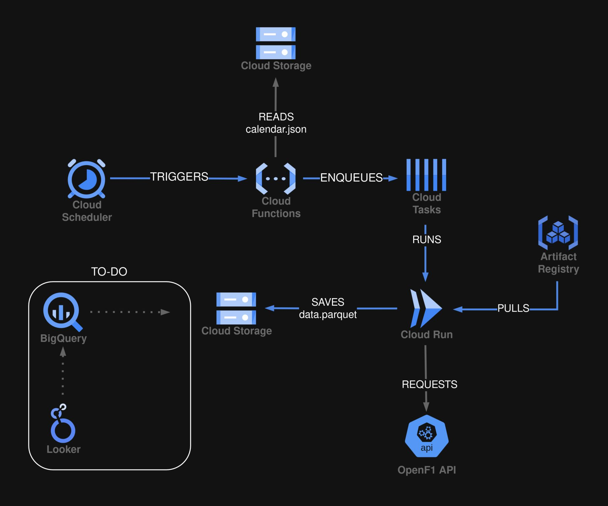

# f1-dataops

A fully serverless, event-driven data pipeline deployed on Google Cloud Platform to extract Formula 1 telemetry data. 

The primary focus of this project is not just data extraction, but the implementation of production-grade infrastructure, strict CI/CD quality gates, and zero-trust security principles.

## Cloud Architecture

  

The extraction flow is entirely serverless and decoupled to ensure scalability and fault tolerance:

1. **Cloud Scheduler** fires a cron job every Monday at 9:00 AM.
2. A **Cloud Function** is invoked to evaluate the current week's calendar. If an F1 race event is scheduled, it generates the required extraction payloads.
3. Payloads are securely enqueued in **Cloud Tasks** to manage concurrency and ensure reliable retries.
4. A containerized Python application running on **Cloud Run** consumes the tasks and performs the heavy extraction.
5. Telemetry, lap times and more data is persisted in a **Cloud Storage** bucket acting as the initial Data Lake.

## Stack

* **IaC:** Terraform
* **Cloud Provider:** GCP
* **Compute & Orchestration:** Cloud Run, Cloud Functions, Cloud Tasks, Cloud Scheduler
* **CI/CD:** GitHub Actions
* Python (3.11+), Docker

## Security & CI/CD Pipeline

The deployment lifecycle is fully automated via GitHub Actions, enforcing strict infrastructure and code standards before reaching production.

## Future

With the EL pipeline stabilized, the next iteration will focus on the data modeling and visualization layers:

- Data Warehousing and Transformation: Read the .parquet files from BigQuery and transform it.

- Visualization: Connect BigQuery to Looker Studio for telemetry dashboards.

- Observability: Set up VMs and deploy Grafana, Prometheus and Loki. Break them on purpose.